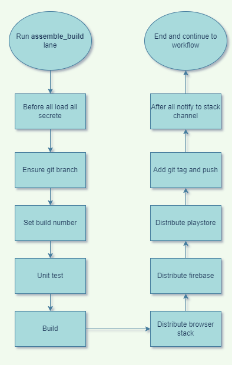
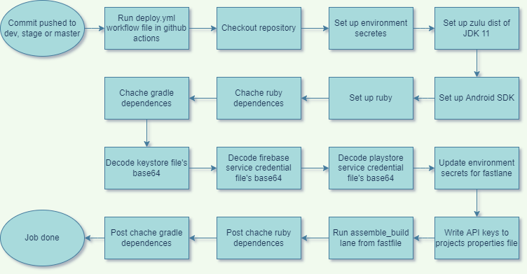

# CI-CD-Android

### Problem :
1. Change in engineering in the team 
2. Repository origin can be changed
3. Rsik of transferring knowledge of release management
4. Migrating platfor (i.e. from native to KMM) 
5. Manual environment management. Example if clients wants to run the app but we moved into Gradle 7 which needs jdk 11 . So clients needs to upgrade to jdk 11. As a non technical person client will need some manual intruction to it.
6. Cretficates(diffrent jks and pass) are managed manually which is really taugh process to maintain.
7. Resource hungry android studio.
8. Need to upgrade version code for every release in playstore
9. Need to notify the team.
10. Need to focus multiple thimgs besides development
11. Kills around 20% time

### Overview of signed apk files
First lets see how .apk gile get genertaed .
* Gradle + JDK creates .dex(Dalvik Executable) files.
* These .dex files are zipped into apk files
* .apk files are zipped into .aab files.
* These files are signed on java keystore (JKS) certificate.

To solve those issue we can move into CI/CD

### CI : Continuous Integration
* Atomic code changes
* Feature flag
* Mitigate risks

### CD : Continuous Delivery
* Risk free delivery
* No certificate management overhead
* Fastest delivery
* Focus on development

[More about CI/CD](https://www.redhat.com/en/topics/devops/what-is-ci-cd)

### fastlane 
* Its an CI/CD tool
* Tools to automate mobile app delivery
* Open-source tools based on ruby
* Protability
* Easily manageable

[fastlane](https://fastlane.tools/)
[fastlane](https://github.com/fastlane/fastlane)

### Example Android app deployment process

  

### Github Workflow and Fastlane

  

